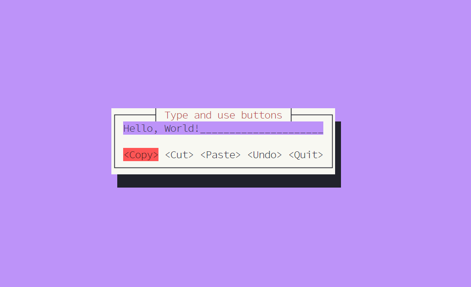

[](https://github.com/fadeevab/design-patterns-rust)

# Design Patterns in Rust

[](https://refactoring.guru)
[](https://www.rust-lang.org/)

This repository contains **Rust** 🦀 examples for **all 23 classic GoF design
patterns**, and even a little more.

All examples are designed to introduce _practical applicability_ in the
**Rust** language. There are _conceptual_ and _real-world_ examples.
In both cases, Rust idiomatic ways of code development and all the specifics
are taken into account.

The repository is developed to be a part of the
[Refactoring.Guru](https://refactoring.guru/design-patterns) project.

## 🔧 Requirements

These examples have been tested with a _stable_ `rustc 1.62` (2021 edition).

All examples can be launched via the command line, using `cargo` as follows:

```bash
cargo run --bin adapter
```

Each target name can be found in `Cargo.toml` of each example:

```toml
[[bin]]
name = "adapter"
path = "main.rs"
```

Also, the examples contain a **README.md** with instructions and additional explanations.

## ✅ List of Examples

```bash
cargo run --bin chain-of-responsibility
cargo run --bin command
cargo run --bin iterator
cargo run --bin mediator
cargo run --bin memento
cargo run --bin memento-serde
cargo run --bin observer
cargo run --bin state
cargo run --bin strategy
cargo run --bin strategy-func
cargo run --bin template-method
cargo run --bin visitor
cargo run --bin abstract-factory
cargo run --bin abstract-factory-dyn
cargo run --bin builder
cargo run --bin factory-method-maze-game
cargo run --bin factory-method-render-dialog
cargo run --bin prototype
cargo run --bin simple-factory
cargo run --bin singleton
cargo run --bin singleton-lazy
cargo run --bin singleton-mutex # Requires Rust 1.63
cargo run --bin static-creation-method
cargo run --bin adapter
cargo run --bin bridge
cargo run --bin composite
cargo run --bin decorator
cargo run --bin facade
cargo run --bin flyweight
cargo run --bin proxy
```

Some examples have visual output.

| Flyweight | State | Command |
| --------- | ----- | ------- |
| [](structural/flyweight) | [](behavioral/state) | [](behavioral/command) |

## 💡 Notes

Interestingly, in Rust:

1. Almost all **structural** and **creational** patterns can be implemented
   using generics, hence, _static dispatch_.
2. Most **behavioral** patterns can NOT be implemented using static dispatch,
   instead, they can be implemented only via _dynamic dispatch_.

A well-thought pattern classification fits the Rust language design perfectly
as "behavior" is dynamic in nature and "structure" is static.

Some patterns are really easy to implement in Rust, mostly
_creational_ ones, e.g.
[Prototype](creational/prototype),
[Static Creation Method](creational/static-creation-method/).

The [Mediator](behavioral/mediator) _behavioral_ pattern
is the hardest to implement with Rust, considering Rust's specific ownership
model with strict borrow checker rules.

## License

This work is licensed under a Creative Commons Attribution-NonCommercial-NoDerivatives 4.0 International License.

<a rel="license" href="http://creativecommons.org/licenses/by-nc-nd/4.0/"></a>

## Credits

Authors: Alexander Fadeev ([@fadeevab](https://github.com/fadeevab)).
