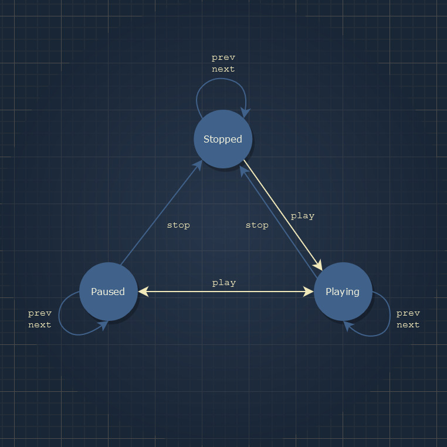
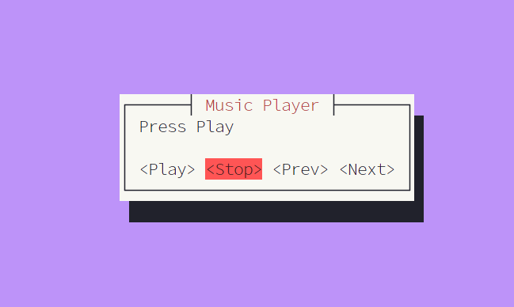
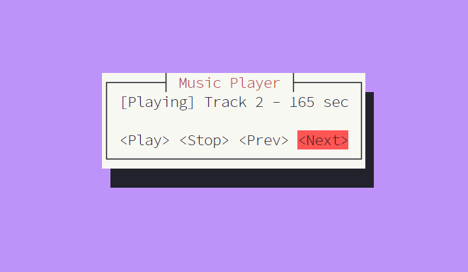

# State

_The **State** pattern is related to a finite-state machine (FSM) concept,
however, instead of implementing a lot of conditional statements, each state is represented by a separate type that implements a common state trait._

Transitions between states depend on the particular trait implementation for
each state type.

The State Pattern in Rust is described in detail in _The Rust Book_:
https://doc.rust-lang.org/book/ch17-03-oo-design-patterns.html

## Music Player

```bash
cargo run --bin state
```

Press buttons, ESC for exit, enjoy!

## Screenshots

|                                |                                |
| ------------------------------ | ------------------------------ |
|  |  |

## Walkthrough

Let's build a music player with the following state transitions:


There is a base trait `State` with `play` and `stop` methods which make state
transitions:

```rust
pub trait State {
    fn play(self: Box<Self>, player: &mut Player) -> Box<dyn State>;
    fn stop(self: Box<Self>, player: &mut Player) -> Box<dyn State>;
}
```

`next` and `prev` don't change state, there are default implementations
in a separate `impl dyn State` block that cannot be overridden.

```rust
impl dyn State {
    pub fn next(self: Box<Self>, player: &mut Player) -> Box<dyn State> {
        self
    }

    pub fn prev(self: Box<Self>, player: &mut Player) -> Box<dyn State> {
        self
    }
}
```

Every state is a type implementing the `trait State`:

```rust
pub struct StoppedState;
pub struct PausedState;
pub struct PlayingState;

impl State for StoppedState {
    ...
}

impl State for PausedState {
    ...
}
```

Anyways, it works as follows:

```rust
let state = Box::new(StoppedState);   // StoppedState.
let state = state.play(&mut player);  // StoppedState -> PlayingState.
let state = state.play(&mut player);  // PlayingState -> PausedState.
```

Here, the same action `play` makes a transition to different states depending
on where it's called from:

1. `StoppedState`'s implementation of `play` starts playback and returns
   `PlayingState`.

   ```rust
   fn play(self: Box<Self>, player: &mut Player) -> Box<dyn State> {
       player.play();

       // Stopped -> Playing.
       Box::new(PlayingState)
   }
   ```

2. `PlayingState` pauses playback after hitting the "play" button again:

   ```rust
   fn play(self: Box<Self>, player: &mut Player) -> Box<dyn State> {
       player.pause();

       // Playing -> Paused.
       Box::new(PausedState)
   }
   ```

💡 The methods are defined with a special `self: Box<Self>` notation.

Why is that?

1. First, `self` is not a reference, it means that the method is a "one shot",
   it consumes `self` and exchanges onto another state returning `Box<dyn State>`.
2. Second, the method consumes the boxed object like `Box<dyn State>` and
   not an object of a concrete type like `PlayingState`, because the concrete
   state is unknown at compile time.

## Reference

[State Pattern in Java (Example)](https://refactoring.guru/design-patterns/state/java/example)
