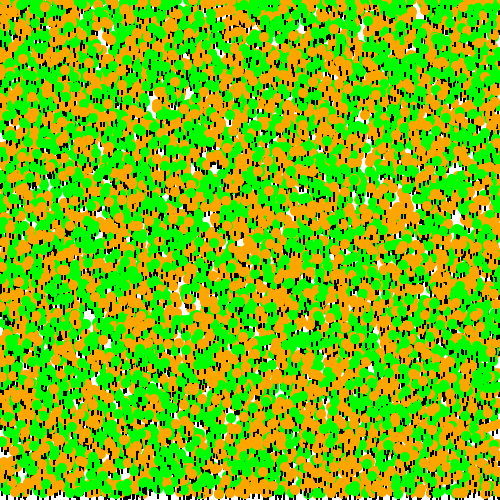

# Flyweight

_**Flyweight** (Cache) is a structural design pattern that allows programs to
support vast quantities of objects by keeping their memory consumption low._

It's an _internal cache_ hidden behind a settle Facade-like API.
The cache stores shared parts that are referenced from multiple objects.
_See more explanation below._


## Rendering a Forest

```bash
cargo run --release
```

## Screenshot

_res/forest.svg_ (10,000 trees):



## RAM usage stats

For 100,000 trees:

```
100000 trees drawn
Cache length: 2 tree kinds
-------------------------------
Memory usage:
Tree size (16 bytes) * 100000
+ TreeKind size (~30 bytes) * 2
-------------------------------
Total: 1MB (instead of 4MB)
```

## Overview

`Forest` has a public API that can not be changed for backward compatibility reasons:

```rust
pub fn plant_tree(&mut self, x: u32, y: u32, color: TreeColor, name: String, data: String);
```

There is an internal cache that is implemented via a `HashSet` that holds
only one copy of a common part (`TreeKind`) of thousands of trees.

```rust
#[derive(Default)]
pub struct Forest {
    cache: HashSet<Rc<TreeKind>>,
    trees: Vec<Tree>,
}
```

The point is having an opaque cache implementation. It can use a hash set,
FIFO, or even a simple vector. And it's hidden behind the API because that's
the point: we try to optimize internals without changing a public method,
otherwise we could always pass a common part from top to bottom.

Other points:
 - `cache` is of `HashSet` type, so it can hold only a single
    instance of a `TreeKind`,
- `Rc` is needed to get the reference on the tree kind without
   cloning a full structure,
- `TreeKind` must derive `Eq`, `PartialEq`, and `Hash` traits to be
   used in the `HashSet`.

## Reference

The example reproduces a [Flyweight Example in Java (Rendering a Forest)](https://refactoring.guru/design-patterns/flyweight/java/example).
